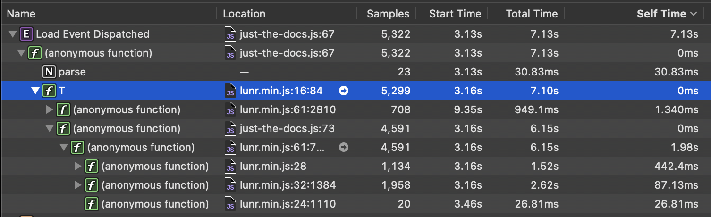

## Comedy Bang Bang Texts

This site contains automated transcriptions of (some of) the Comedy Bang Bang podcast episodes. Try the search!

## Technical Details

The transcriptions were created using the fantastic [whisper.cpp](https://github.com/ggerganov/whisper.cpp) project, using the 'medium-en' model. I wrote a little [script](https://gist.github.com/dreness/2ca0bbd16402ff00621974e7815c51ca) to mostly automate the process, in particular to support clean interrupt and resume.

whisper.cpp can produce transcriptions in various file formats (vtt, srt, text, csv), however none of those are quite right for Github Pages, which wants markdown. Some decisions have to be made regarding how to format the markdown text, since a single line break doesn't affect the layout of normal body text. I tried a few differnet things and for now settled on one sentence per line, which in markdown means one sentence every *two* lines.

To do the conversion from vtt to markdown, I used [vtt2txt](https://github.com/TruthfulTechnology/pm-vtt2txt) with two small [modifications](https://github.com/TruthfulTechnology/pm-vtt2txt/issues/1):

* add two line breaks instead of one between each sentence
* remove duplicate sentences

### More Work

* [ ] Improve the page-load experience, which is currently not great. The search index is not at all optimized, and with only around half the episodes indexed, weighs in at 13.1 MB as a json file. The search library built into just-the-docs is Lunr.js, which requires several seconds to load the index (even if it is cached locally).

* [ ] Clean up the file names, which I'm guessing were generated by my podcast client, because the XML podcast feed contains no filenames.
* [ ] Improve frontmatter metadata
  * [ ] date / time
  * [ ] episode number
  * [ ] guest names
  * [ ] topics
* [ ] word cloud?
* [ ] browsable cross-reference?
